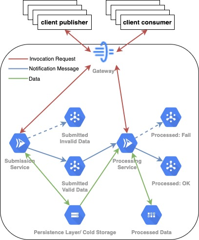

# Ginkgo Analytics - GCP Data Pipeline Case Study <!-- omit in toc -->

## Table of Contents <!-- omit in toc -->
  * [Objectives](#objectives)
    + [Requirements](#requirements)
    + [Assumptions](#assumptions)
  * [Platform Architecture](#platform-architecture)
    + [GCP Infrastructure Design](#gcp-infrastructure-design)
  * [Demo](#demo)
  * [Development](#development)
    + [Project Structure](#project-structure)
    + [Requirements](#requirements-1)
    + [How to Run](#how-to-run)
  * [Further Steps](#further-steps)
    + [User Facing](#user-facing)
    + [Security](#security)
    + [Ops](#ops)
    + [CD](#cd)
    + [Applications](#applications)
    + [Infra](#infra)

## Objectives

**The goal**: to build an event-driven platform to persist and process semi-structured data submitted over an HTTP interface. Find detailed description of the project [here](./docu/description.pdf).

### Requirements

- The platform shall provide a secure HTTP interface with the POST method to allow for data samples submission. A data sample example can be found [here](./fixture/sample.json).

- Input data *must* be preserved

- The input data shall be transformed:

    - The timestamp (the values of the "time_stamp" attribute, ISO timestamp) timezone to be set to UTC

    - The mean and the standard deviation of the data distribution (content of the "data" attribute) to be calculated

    - Transformation results to be preserved and available for further consumption

### Assumptions

[The problem statement](./docu/description.pdf) omits fair amount of technical requirements. To complete the projects scope, the following assumption have been made:

- One message payload won't exceed a couple of dozens of Megabytes (1 Mb being a rough equivalent of 1M floating point values)

- Data velocity won't exceed few dozens of thousands messages a second, or few dozens Megabytes per second

- Processed data to be consumed through an HTTP interface

- Submission request to be executed synchronously to guarantee data delivery

- Submitted data to be validated to provide synchronous feedback to a publisher on whether the data have been corrupted

- The data to be processed asynchronously to satisfy single responsibility principle and to assure platform scalability and maintainability

- The platform design to follow (a sort of) "event-driven" architecture with the focus on fast processing branch: every micro-batch is being processed upon its receiving

- The business logic to be developed using a technology appropriate for distributed systems with high community acceptance rate and comfortable dev environment tooling (fast compiler, test suite etc.)

- The programs caring the business logic shall be designed following modular structure to allow fast development cycle for potential future adjustments

- The platform services to be deployed following "serverless" approach to reduce maintenance overkill. Although, the application design shall give flexibility for potential migration to a different infrastructure (e.g. to a k8s cluster).

- It is sufficient to authorize the platform clients using API keys

## Platform Architecture

A high level overview of the architecture elements is illustrated on the diagram below.


### GCP Infrastructure Design



## Demo

Interactive API contract can be found [here](https://app.swaggerhub.com/apis-docs/kislerdm/ginkgo/v1.0). To communicate with the platform, please request the API access key.

## Development

### Project Structure

```bash
.
├── LICENSE
├── Makefile
├── README.md
├── docu
├── fixture         <- data sample(s)
├── infra           <- infrastructure resources definition
└── services        <- submission and processing services codebase
    ├── Dockerfile
    ├── lib         <- services common libs/clients
    ├── models      <- common response models (jsonschema)
    ├── process     <- data processing service codebase
    └── submit      <- data submission service codebase
```

### Requirements

**Tools**:

- [Docker](https://www.docker.com/) *ver. ~= 20.1*

- [terraform](https://www.terraform.io/) *ver. ~= 1.0*

- [GNU make](https://www.gnu.org/software/make/)

- For local dev./testing: [go](https://golang.org/) *ver. 1.16*

**Infra**:

- A GCP project with active billing

- A GCP service account with an extensive access rights (e.g. *project owner*):

- [Service account private key](https://cloud.google.com/iam/docs/creating-managing-service-account-keys#iam-service-account-keys-create-gcloud) stored to `${HOME}/.gcp/ginkgo/terraform.json`

**Note** Don't forget to export the key path as envvar:

```bash
export GOOGLE_APPLICATION_CREDENTIALS=${HOME}/.gcp/ginkgo/terraform.json
```

### How to Run

- To (re-)deploy the whole stack (only state diff would be re-deployed):

```bash
make deploy
```

- To run unit tests:

```bash
make service.test SERVICE_NAME=submit # submission service
make service.test SERVICE_NAME=process # processing service
```

- To build the services' docker images:

```bash
make service.image.build SERVICE_NAME=submit PROJECT_ID=${GCP_PROJECT} # submission service
make service.image.build SERVICE_NAME=process PROJECT_ID=${GCP_PROJECT} # processing service
```

- To push the services' docker images to the GCP container registry:

```bash
make service.image.push SERVICE_NAME=submit PROJECT_ID=${GCP_PROJECT} # submission service
make service.image.push SERVICE_NAME=process PROJECT_ID=${GCP_PROJECT} # processing service
```

**Note**: auth with the GCP registry would be required, see details [here](https://cloud.google.com/container-registry/docs/advanced-authentication).

**Note**: To combine the build and push steps, the command `make service.rebuild` could be used with the arguments `PROJECT_ID` and `SERVICE_NAME`.

## Further Steps

### User Facing

- Add authentication step for users to be able to request an access token

### Security

- Replace API key authentication with the OAuth2 protocol compliant system

### Ops

- Add monitoring and alerts notifications system

- Perform load test and define SLA

### CD

- Improve unit tests coverage

- Add smoke tests

### Applications

- Perform CPU/memory/execution time profiling

- Depending on followup requirements to scalability and on profiling results, it may be required to re-design the applications, or consider different technologies

### Infra

- Depending on followup requirements to scalability and on load tests results, it may be required to migrate the services onto a k8s cluster
