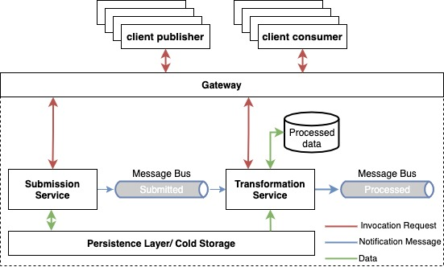

# Ginkgo Analytics - GCP Data Pipeline Case Study <!-- omit in toc -->

## Table of Contents <!-- omit in toc -->
  * [Objectives](#objectives)
    + [Requirements](#requirements)
    + [Assumptions](#assumptions)
  * [Platform Architecture](#platform-architecture)

## Objectives

**The goal**: to build an event-driven platform to persist and process semi-structured data submitted over an HTTP interface. Find detailed description of the project [here](./docu/description.pdf).

### Requirements

- The platform shall provide a secure HTTP interface with the POST method to allow for data samples submission. A data sample example can be found [here](./fixture/sample.json).

- Input data *must* be preserved

- The input data shall be transformed:

    - The timestamp (the values of the "time_stamp" attribute, ISO timestamp) timezone to be set to UTC

    - The mean and the standard deviation of the data distribution (content of the "data" attribute) to be calculated

    - Transformation results to be preserved and available for further consumption

### Assumptions

[The problem statement](./docu/description.pdf) omits fair amount of technical requirements. To complete the projects scope, the following assumption have been made:

- One message payload won't exceed a couple of dozens of Megabytes (1 Mb being a rough equivalent of 1M floating point values)

- Data velocity won't exceed few dozens of thousands messages a second, or few dozens Megabytes per second

- Processed data to be consumed through an HTTP interface

- Submission request to be executed synchronously to guarantee data delivery

- Submitted data to be validated to provide synchronous feedback to a publisher on whether the data have been corrupted

- The data to be processed asynchronously to satisfy single responsibility principle and to assure platform scalability and maintainability

- The platform design to follow (a sort of) "event-driven" architecture with the focus on fast processing branch: every micro-batch is being processed upon its receiving

- The business logic to be developed using a technology appropriate for distributed systems with high community acceptance rate and comfortable dev environment tooling (fast compiler, test suite etc.)

- The programs caring the business logic shall be designed following modular structure to allow fast development cycle for potential future adjustments

- The platform services to be deployed following "serverless" approach to reduce maintenance overkill. Although, the application design shall give flexibility for potential migration to a different infrastructure (e.g. to a k8s cluster).

- It is sufficient to authorize the platform clients using API keys

## Platform Architecture

A high level overview of the architecture elements is illustrated on the diagram below.

### GCP Infrastructure Design

